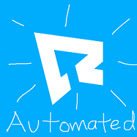
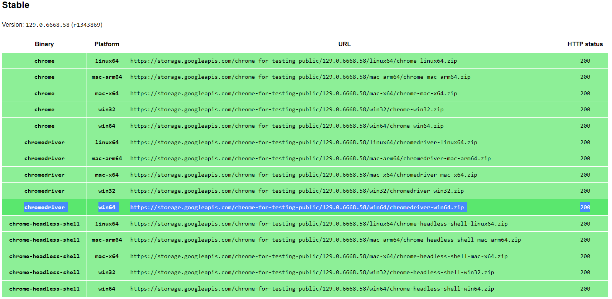
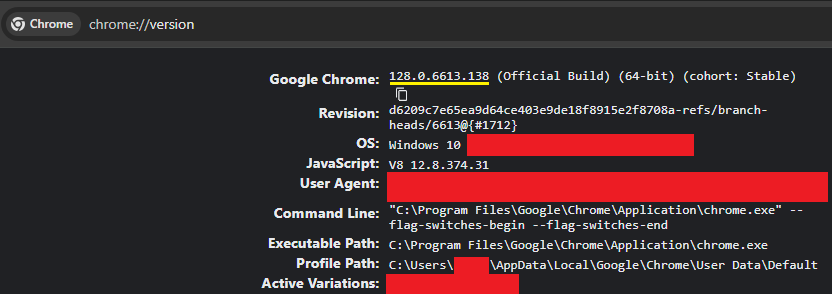
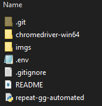

  

# Repeat.gg Automated

This program helps automate the process of joining tourneys using Selenium.

Steps:

1. Make sure you have the latest version of Google Chrome installed. If not then it can be installed here: https://www.google.com/chrome/

2. Install the same Chrome Driver version as Google Chrome. If not then install it through this site: https://googlechromelabs.github.io/chrome-for-testing/#stable

   

   You can check your Google Chrome version by typing **chrome://version/** into the search bar. It is highlighted in yellow.

   

3. Unzip and place the chromedriver-win64 folder version inside the same folder as your other files.

   

4. Create a .env file and place it inside the same directory as your chromedriver folder.

5. Inside your .env file you want to make sure you have 3 variables:

   PROFILE_PATH=C:\Users\xxx\AppData\Local\Google\Chrome\User Data
   
   PROFILE_NAME=Default
   
   CHROMEDRIVER_PATH=C:\yyy\chromedriver-win64\chromedriver.exe

   Replace **xxx** with your user.
   Replace **yyy** with the path to your chromedriver-win64 location. This should be located in the same folder that you unzipped earlier.

6. Log into your account on repeat.gg if not already

7. Run the repeat-gg-automated.py file