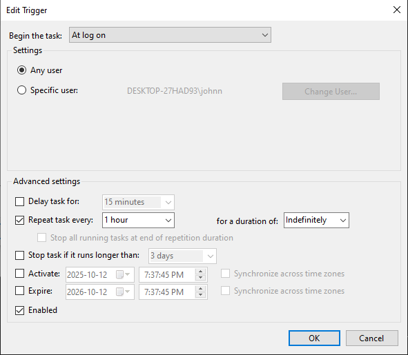
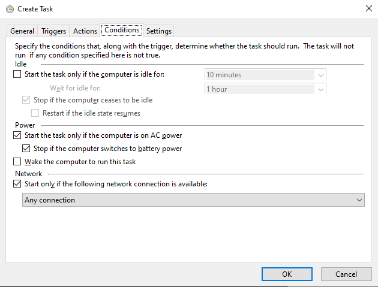

<p align="center">
  
</p>

# Repeat.gg Automated

This program helps automate the process of joining tourneys using Selenium.

## Steps:

1. Make sure you have the latest version of Google Chrome installed. If not then it can be installed here: https://www.google.com/chrome/

2. Install the same Chrome Driver version as Google Chrome. If not then install it through this site: https://googlechromelabs.github.io/chrome-for-testing/#stable

   

   You can check your Google Chrome version by typing **chrome://version/** into the search bar. It is highlighted in yellow.

   

3. Unzip and place the chromedriver-win64 folder version inside the same folder as your other files.

   

4. Create a .env file and place it inside the same directory as your chromedriver folder.

5. Inside your .env file you want to make sure you have 3 variables:

   ```
   PROFILE_PATH=C:\Users\xxx\AppData\Local\Google\Chrome\User Data
   PROFILE_NAME=Default
   CHROMEDRIVER_PATH=C:\yyy\chromedriver-win64\chromedriver.exe
   ```

   Replace **xxx** with your user.
   <br/>
   Replace **yyy** with the path to your chromedriver-win64 location. This should be located in the same folder that you unzipped earlier.
   <br/>
   <br/>
   Replace your profile with the correct one. This can be found in the same directory as your profile path. They are usually Default, Profile 1, Profile 2, Profile 3, etc

6. Log into your account on repeat.gg if not already (Make sure you're logged in on the same Chrome Profile that's specified)

7. Install Python dependencies:
   ```bash
   pip install -r requirements.txt
   ```

8. Run the automation:
   - **Double-click `run_automation.bat`** to start the automation
   - Or run directly: `python repeat-gg-automated.py`

---

## 🤖 Automating with Windows Task Scheduler

You can set this up to run automatically in the background every few hours using the included `run_automation.bat` file. When scheduled through Task Scheduler, it will run in the background without disrupting your current window focus.

### Step-by-Step Setup:

1. **Open Windows Task Scheduler:**
   - Press `Win + R`, type `taskschd.msc`, press Enter

2. **Create a new task:**
   - Click **"Create Task"** in the right panel (NOT "Create Basic Task")
   
   

3. **General tab settings:**
   - Name: `Repeat.gg Automation` (or whatever you prefer)
   - Description: `Auto-join free tournaments` (optional)
   - Configure for: **Windows 10**
   
   

4. **Set up a trigger:**
   - Go to the **Triggers** tab
   - Click **"New..."** to create a new trigger
   
   
   
   - Configure your trigger settings (choose what works for you):
     - Begin the task: `On a schedule` or `Daily`
     - Set your preferred start time
     - Repeat task every: `6 hours` (or your preferred interval)
     - For a duration of: `Indefinitely`
   
   

5. **Set up an action:**
   - Go to the **Actions** tab
   - Click **"New..."** to create a new action
   
   
   
   - Action: `Start a program`
   - Program/script: Click **"Browse..."** and navigate to your `run_automation.bat` file
   
   

6. **Optional settings:**
   - You can configure additional settings in the **Conditions** and **Settings** tabs based on your preferences
   - These are optional and depend on what you want (power settings, network conditions, etc.)

   

7. **Click OK to save the task**

The task will now run automatically at your scheduled times in the background!

### Tips:

- **Runs in background:** When scheduled through Task Scheduler, the console runs in the background and won't steal focus from your current window
- **For testing manually:** Just double-click `run_automation.bat` to see it work
- Set `HEADLESS_MODE = True` in the script (line 18) for invisible browser
- Your computer must be on for the task to run
- Check Task Scheduler's "History" tab to see if tasks ran successfully
